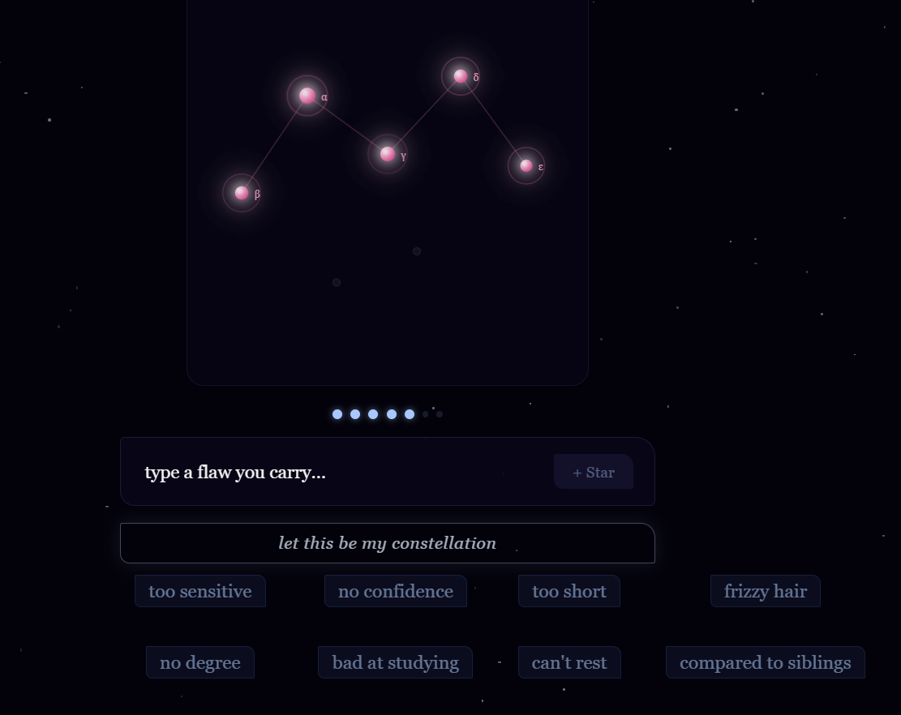

欠点は隠された光

自分の欠点を変えたくて　もがいてきました
しかし　欠点も　見方を変えれば魅力になる
自分の気になる点を自由に書く
または選択肢から選んで下さい

アプリ体験
https://hidden-constellation.vercel.app

 hidden-constellation

*you are held by your own light*

A quiet web app that draws a constellation from what you carry inside.

🌌 Live:[hidden-constellation.vercel.app](https://hidden-constellation.vercel.app)

---

✨️ About

`hidden-constellation` is a one-minute digital sanctuary.

You arrive. A constellation appears. A single line of poetry meets you in the dark.
Then you leave — a little lighter, or simply held for a moment.

This app does not advise you. It witnesses you.

---

🌠The 20 Messages

Inside this app, 20 short poetic messages wait quietly among the stars.

They are deliberately open. Each phrase is a small mirror, not a statement.

へしPlease receive each message in your own state, on your own terms.
The same words may mean tenderness one night, and regret another.
They may speak of someone you love, someone you have lost,
someone you will meet in another life, or the part of yourself you have been hiding.

There is no correct interpretation.
Your reading *is* the meaning.

Philosophy

After 30 years of witnessing students, I craft tiny apps that witness you.
Poetic apps where voice and code become one — inspired by Yonezu Kenshi.

Built on the belief that some feelings cannot be solved, only held.

 Tech

- Vite + React + TypeScript
- Canvas / WebGL for star rendering
- Deployed on Vercel
- No tracking. No accounts. No data leaves your device.

---

 Other works

- [today, a small planet](https://today-a-small-planet.vercel.app)
- [fluorite](https://fluorite-en.vercel.app)
- [sweet sorrow](https://sweet-sorrow19910310.vercel.app)
- [Linktree](https://linktr.ee/) — all apps & writing

🩷 Author

 `kinuyo.nezu`
[Medium](https://medium.com/@kinuyo.nezu) · [Product Hunt](https://www.producthunt.com/)

---

*For anyone holding a light no one else can see.*
